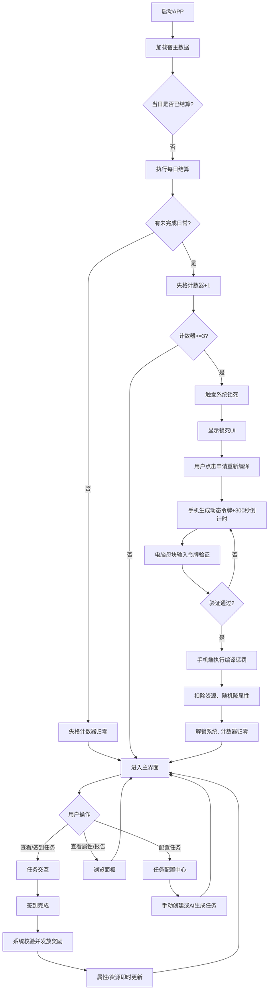
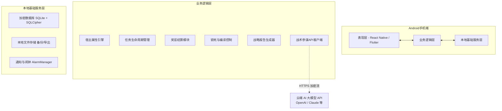
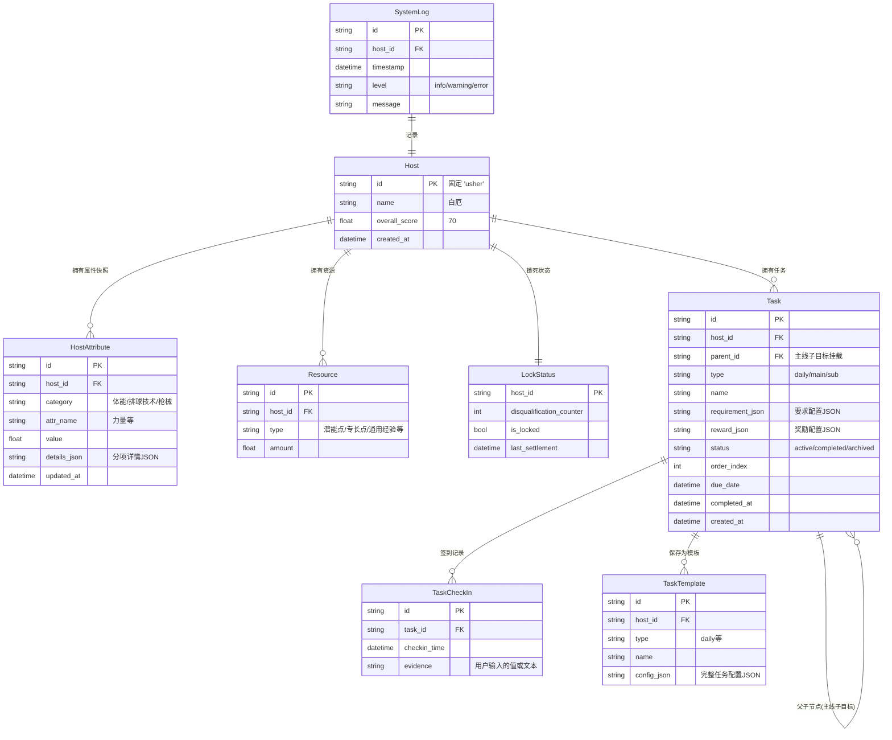

以下是根据之前的全部讨论内容，参照你提供的文档格式，为“宿主白厄·个人战术管理系统”APP生成的最终技术文档。

---

# 宿主白厄·个人战术管理系统 —— 技术文档 v1.0（最终定稿）

## 第1批：项目背景、核心目标与目标用户

### 1.1 项目背景

在自我量化与游戏化激励的实践中，现有工具普遍存在以下断层：

**一、成长缺乏即时数值反馈**
- 大多数习惯追踪器仅提供打卡、连续天数统计，无法将日常训练、任务完成量化为具体的属性值（力量、速度、技能专精等），导致用户无法直观感知自己的多维成长。

**二、任务与能力提升脱节**
- 现实中的任务（如训练、学习、项目）与个人能力面板之间没有映射关系。完成一个主线项目后，无法看到对应属性的提升和等级解锁。

**三、自律依赖纯意志力**
- 缺少带有硬性惩罚的约束机制。普通的任务App可以无限期拖延，没有“失败成本”，缺乏一个像游戏或军事训练中“未达标即锁死系统”的强力外部约束。

**四、任务计划无智能辅助**
- 用户在设定大型目标时，需要手动拆解为子任务和步骤，缺少一个能根据用户当前属性、历史习惯自动生成任务草案的AI参谋。

### 1.2 核心目标

本软件为宿主“白厄”量身打造一个以**游戏属性面板**为顶层呈现、以**手动签到硬核约束**为底层驱动的个人战术管理系统，实现以下四大核心目标：

1. **属性量化与可视化**：将身体体能、专项技能（排球/枪械）转化为可增长的数值，并通过综合评分、雷达图、趋势图展示成长轨迹。

2. **任务驱动闭环**：提供可配置的日常任务、主线/支线任务系统，通过手动签到确认完成，系统自动发放奖励并更新属性面板，形成“执行→反馈→成长”闭环。

3. **硬核惩罚机制**：引入“失格计数器”与“系统锁死”，连续3天未完成日常任务将锁定APP，须通过手机与电脑双端编译仪式解锁，并承受永久性的资源和属性损失。

4. **智能任务生成**：集成战术参谋API，可根据用户输入的目标描述，结合当前属性，自动生成主线/支线任务草案，支持后续沟通调整与微调激活。

**最终定位**：成为白厄的“单兵战术终端”——一个记录、驱动、约束、指导其现实进化的硬核面板。

### 1.3 目标用户

| 用户群体                 | 典型场景                                                     | 核心价值诉求                                                 |
| ------------------------ | ------------------------------------------------------------ | ------------------------------------------------------------ |
| **宿主白厄（唯一用户）** | 每日体能训练、枪械练习、大型周期目标（如备战联赛），需将一切行动转化为属性增长和任务进度。 | 查看属性面板明确自身强弱项；通过手动签到获得成长正反馈；依靠锁死惩罚杜绝懈怠；用AI参谋快速规划长期任务。 |

---

## 第2批：核心功能清单 + 业务流程图

### 2.1 核心功能清单

| 模块                  | 功能点               | 详细描述                                                     | 优先级 |
| --------------------- | -------------------- | ------------------------------------------------------------ | ------ |
| **1. 宿主状态面板**   | 身份与综合评分展示   | 固定显示宿主ID“白厄”，综合评分（70）及权重公式说明，外圈呼吸灯效果。 | P0     |
|                       | 体能综合指标         | 展示力量、速度、体力、弹跳等属性及分项进度条，数值变动时有闪烁飘字动画。 | P0     |
|                       | 专项能力指标         | 分“排球方向”与“枪械战斗方向”，以柱状图、列表、进度环等形式展示技能等级、经验值和加成。 | P0     |
|                       | 属性变化日志         | 按时间线展示每次属性变动的原因和数值（如“06-09 10:30 日常·基础训练 力量+0.05”）。 | P1     |
| **2. 任务系统**       | 日常任务（每日刷新） | 预置“基础训练”“枪械校准”“状态维护”等，支持分段签到，全部完成后方可重置失格计数器。 | P0     |
|                       | 主线/支线任务        | 支持多子目标（主线最多5个），进度条显示，每个子目标独立签到。全部完成后一次性领取高额奖励。 | P0     |
|                       | 任务配置中心         | 可创建、编辑、删除日常任务模板（数值/百分比/时间型），自行设定奖励；主线/支线任务可手动创建或由AI生成。 | P0     |
|                       | 战术参谋API集成      | 输入目标描述，调用AI返回结构化任务草案（任务名、子目标、奖励），用户可沟通调整、重新评估难度，满意后微调激活。 | P1     |
|                       | 任务模板库           | 日常任务可保存为模板复用；主线任务奖励由系统根据难度自动生成，宿主不直接编辑数值。 | P2     |
|                       | 日历联动（预留）     | 任务截止时间可同步至系统日历，未来可反向生成关联待办。（当前版本仅本地存储） | P2     |
| **3. 成长资源**       | 资源背包             | 展示潜能点、专长点、通用经验、隐匿经验的当前数量及来源明细。 | P0     |
|                       | 资源消费（预留）     | 未来可通过消费专长点解锁技能树，当前版本仅做资源展示。       | P2     |
| **4. 战略报告**       | 周报                 | 展示本周任务完成率环形图、六维属性对比雷达图、关键事件时间线。 | P1     |
|                       | 月报                 | 展示月度综合评分趋势折线图、属性构成变化堆叠柱状图，并附系统评语。 | P1     |
| **5. 惩罚与锁死系统** | 失格计数器           | 隐藏计数器，每日结算（打开APP或凌晨检查）时，若有未完成日常则+1，全部完成则归零。 | P0     |
|                       | 系统锁死             | 计数器达3天时触发，所有界面被破碎玻璃效果覆盖，仅显示警告和“申请重新编译”按钮。 | P0     |
|                       | 双端重新编译         | 手机端生成动态令牌，需在电脑母块程序输入验证；验证后强制执行扣除20%通用经验、清空潜能点、全属性随机降低1%-3%的惩罚，解锁系统。 | P0     |
| **6. 系统管理**       | 系统日志             | 以严谨格式记录所有签到、奖励发放、惩罚触发、锁死等事件，可筛选查看。 | P1     |
|                       | 数据备份与恢复       | 一键导出加密/未加密数据库；定时自动备份，保留最近3版；启动时完整性检查，支持从备份恢复。 | P1     |
|                       | 底层编译室           | 提供导出作战数据（JSON/CSV）、手动触发锁死、完全重置系统（需24位确认码）等高级功能。 | P2     |

### 2.2 业务流程图



---

## 第3批：技术架构（Android版 · 纯本地 + 按需联网）

### 3.1 设计原则

| 原则                   | 说明                                                         |
| ---------------------- | ------------------------------------------------------------ |
| **数据完全本地主权**   | 所有属性、任务、日志等数据仅存于手机本地加密数据库，不上传任何第三方。AI功能仅在用户主动调用时发送脱敏后的目标描述。 |
| **离线优先，按需联网** | 核心闭环（任务、签到、奖惩、报告）完全离线运行。AI生成任务和后续语音功能（预留）等才需联网。 |
| **硬核惩罚不可绕过**   | 锁死机制完全本地实现，动态令牌验证采用非对称加密思想，电脑母块仅作为授权工具。 |
| **简单可维护**         | 技术栈选择成熟、稳定，适配自用场景，不追求过大用户量下的性能极限。 |

### 3.2 总体架构图



### 3.3 技术选型与理由

| 模块             | 选型                                           | 理由                                                         |
| ---------------- | ---------------------------------------------- | ------------------------------------------------------------ |
| **UI框架**       | React Native (推荐) 或 Flutter                 | 快速构建仪表盘、图表、列表等界面，社区成熟，自用无需极致性能。 |
| **本地数据库**   | SQLite + SQLCipher                             | 全库加密，支持FTS5全文搜索（日志），事务保障数据一致性。     |
| **图表**         | react-native-chart-kit 或 fl_chart             | 支持雷达图、环形图、折线图、柱状图，满足报告需求。           |
| **动画**         | Lottie + 自定义Canvas                          | 实现数值变化飘字、锁死破碎玻璃等效果。                       |
| **后台任务**     | WorkManager + AlarmManager                     | 每日凌晨触发结算（即使App未启动），确保锁死机制可靠。        |
| **网络**         | Axios / Dio                                    | 简单的HTTPS请求，调用AI API。                                |
| **安全存储**     | react-native-keychain / flutter_secure_storage | 存储API Key及动态令牌种子。                                  |
| **本地备份**     | react-native-fs / path_provider                | 复制数据库文件至指定目录，并管理备份版本。                   |
| **电脑母块程序** | Python脚本（PyInstaller打包）或Electron        | 简单的命令行工具，接收用户输入的令牌，通过预共享密钥或算法验证。 |

### 3.4 关键场景实现

- **每日结算与锁死触发**：WorkManager 设置每日凌晨3点的周期性任务，检查所有已启用的日常任务在昨日的签到记录。若有不完成，`disqualification_counter` +1；否则归零。如果+1后计数≥3，则在数据库中设置 `system_locked = true`。App启动或回到前台时检查此标志，若为真则渲染锁死UI。

- **双端验证机制**：采用**时间戳+预共享密钥**的简单方案（无服务器）。手机和电脑母块共享一个秘密种子（首次配置时通过二维码或手动输入设置）。手机点击“申请编译”时，基于当前时间戳和种子生成6位动态令牌（如TOTP算法，时间步长30秒）。用户在电脑母块程序输入该令牌，母块用同样算法验证，若匹配则显示“验证通过”，手机端即可解锁。这种方式无需网络，安全性满足自用需求。

- **AI生成任务**：用户输入目标描述，APP调用OpenAI/Claude API，发送带有当前属性摘要和任务格式要求的Prompt，获取结构化JSON后解析为任务草案，显示在界面供用户调整。API Key由用户在设置中配置。

- **数据备份与恢复**：WorkManager每日凌晨执行备份，复制数据库文件至私有目录，命名为 `tactical_backup_YYYYMMDD.db`，保留最近3份。启动时执行 `PRAGMA integrity_check`，若失败则弹窗提示从备份恢复。恢复时关闭数据库连接，复制备份文件覆盖原文件，重新打开。

---

## 第4批：数据模型/ER图/核心表结构

### 4.1 实体关系图（ER图）



### 4.2 核心表结构

- **host_attribute**：属性名与值分离存储，details_json 存储分项细节（如 `{"core":83.8, "arm":83.8}`）。每次更新插入新记录并更新时间戳，便于回溯历史。

- **task**：
  - `type` 区分 daily/sub/main（支线可视为主线的单子目标特例，统一用main）。
  - `requirement_json` 示例：`{"type":"duration","target":60,"unit":"分钟"}` 或 `{"type":"numeric","target":100,"unit":"次"}`。
  - `reward_json` 示例：`[{"type":"universal_exp","amount":10},{"type":"attribute","name":"力量","amount":0.05}]`。
  - 主线任务通过 `parent_id` 关联子目标（父任务 type=main，子目标 type=main_sub），子目标本身可以是独立任务记录。

- **task_check_in**：记录每次签到证据，用于日后审计和防止作弊（如要求输入命中率变化）。

- **lock_status**：单行记录，存储当前失格计数和锁死状态。

- **system_log**：不可变日志，记录关键事件用于诊断和回顾。

---

## 第5批：接口设计/API概要

### 5.1 战术参谋API（外部）

- **端点**：`POST https://api.openai.com/v1/chat/completions`（示例）
- **请求头**：`Authorization: Bearer {API_KEY}`
- **请求体**：
  ```json
  {
    "model": "gpt-4o",
    "messages": [
      {
        "role": "system",
        "content": "你是一个任务生成器。根据用户的输入和当前宿主属性，生成一个主线任务草案..."
      },
      {
        "role": "user",
        "content": "目标：3个月内备战业余排球联赛。当前属性：力量83.8，速度80.2，... 请生成任务。"
      }
    ],
    "response_format": { "type": "json_object" }
  }
  ```
- **期望响应**：结构化JSON，包含 `mission_name`, `sub_goals` (数组，每项含 `name`, `target`, `unit` 等), `estimated_rewards` 等。

### 5.2 双端验证算法（本地逻辑，非网络API）

手机端和电脑母块使用相同的TOTP算法（时间步长30秒，共享种子）。APP生成令牌：`token = TOTP(seed, current_time)`，显示给用户。电脑母块程序让用户输入此令牌，用相同种子和时间窗口验证。无需网络。

### 5.3 数据备份与导出

- **导出JSON**：通过Repository层查询所有宿主数据，序列化为JSON文件，提供分享/保存。
- **数据库备份**：使用 `File.copy` 复制数据库文件到备份目录。

---

## 第6批：部署方案 + 运维策略（自用不上架）

### 6.1 部署方式

- **分发**：通过GitHub私有仓库Release下载APK，或直接使用ADB安装。
- **首次配置**：
  - 引导用户设置设备锁屏密码（作为加密数据库的密钥衍生因子）。
  - 设置API Key（若使用AI功能）。
  - 设置电脑母块共享种子（可生成二维码供电脑扫描，或手动输入）。
- **权限需求**：前台服务（可选，用于定时结算）、开机自启（可选，保证WorkManager）、存储权限（备份）。无悬浮窗、无障碍等复杂权限。

### 6.2 运维与诊断

- **诊断模式**：连续点击宿主ID区域5次进入，查看数据库状态、锁死计数器、最近日志。
- **备份与恢复**：
  - 设置内提供“立即备份”和“从备份恢复”按钮。
  - 自动备份每日执行，保留3代。
  - 数据库损坏时自动弹窗提示恢复。
- **更新**：应用内检查GitHub Release，下载APK并提示安装。
- **日志**：`system_log` 表可导出，用于分析长期行为。

---

## 第7批：顾虑点与重点审查部分

### 7.1 技术风险

1. **每日结算可靠性**：WorkManager在国产ROM上可能被延迟或杀死。需引导用户将应用加入电池优化白名单，并提供厂商特定设置跳转链接。作为自用，可接受偶尔延迟至下次打开App时补结算。

2. **AI任务生成质量**：依赖用户输入的目标描述质量和AI本身。草案必须经用户确认和微调，不可直接激活，避免不合理任务进入系统。

3. **双端验证种子泄露**：若手机丢失，母块种子可能被提取？因为自用场景，物理安全可依赖。种子存储于Android Keystore中，增加提取难度。

### 7.2 系统限制

4. **属性衰减幅度**：锁定后的属性降低1%-3%随机，需在UI上明确公示惩罚细节，避免用户困惑。同时确保降低后的属性不会导致后续任务要求无法达成（如力量降低后原定任务要求不调整，这是惩罚的一部分）。

5. **资源扣除边界**：若用户通用经验已为0，扣除20%仍为0，惩罚依然有效（潜能点清空）。系统需处理资源不足时的扣除逻辑，避免负数。

### 7.3 数据完整性

6. **数据库损坏应对**：如前所述，通过自动备份和启动检查来应对。定期手动备份导出JSON作为最终安全网。

7. **签名防篡改**：APK签名确保不被修改，避免用户自己重编译APP绕过锁死。但自用场景下，用户有意识地遵守规则，技术防破解优先级不高。

---

## 附：开发者实战策略总结

1. **先建立数据骨架**：创建SQLite表，实现Repository，构建宿主属性、任务、日志的CRUD。
2. **实现任务闭环（P0）**：手动创建日常任务→签到→奖励结算→属性更新→失格计数更新。完成核心循环。
3. **实现锁死与双端验证**：封装TOTP逻辑，开发简单的电脑母块Python脚本，集成锁死UI。
4. **构建属性面板与报告**：静态展示→动态刷新→图表集成。
5. **集成AI生成任务**：在任务配置中心增加“AI生成”入口，封装API调用，解析返回为草案并允许编辑。
6. **打磨与备份**：实现自动备份、恢复、日志系统，添加设置页面。
7. **自用适配**：针对自己的手机型号优化保活引导，编写简单的用户手册（电子版）。

---

**文档版本**：v1.0 最终定稿  
**覆盖平台**：Android（自用不上架）  
**核心模式**：纯本地 + 按需联网AI + 双端验证硬核惩罚  
**优化重点**：手动签到闭环、锁死仪式、AI任务生成草案、数据备份恢复

现在，这份文档已经可以作为开发“宿主白厄·个人战术管理系统”APP的完整技术基线。可以开始写代码了。